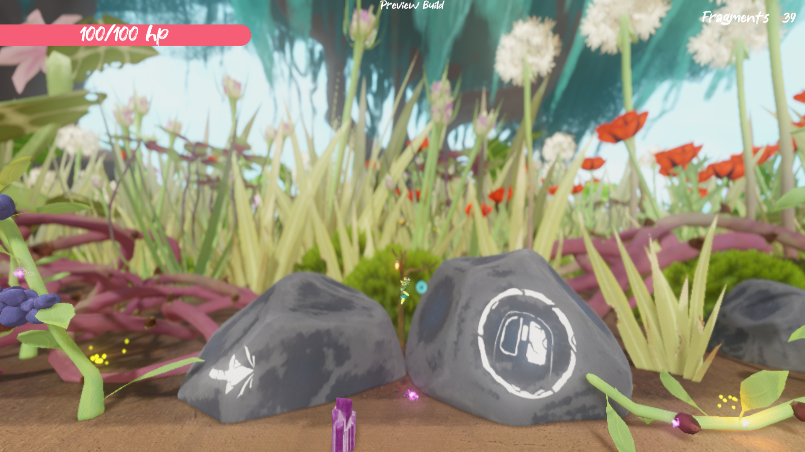
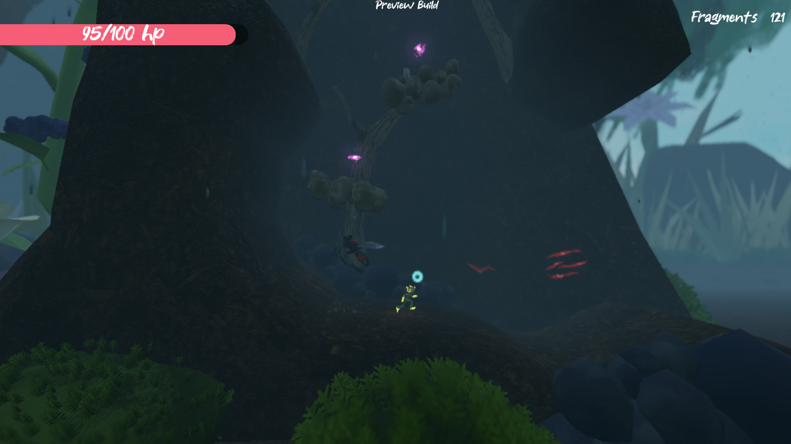
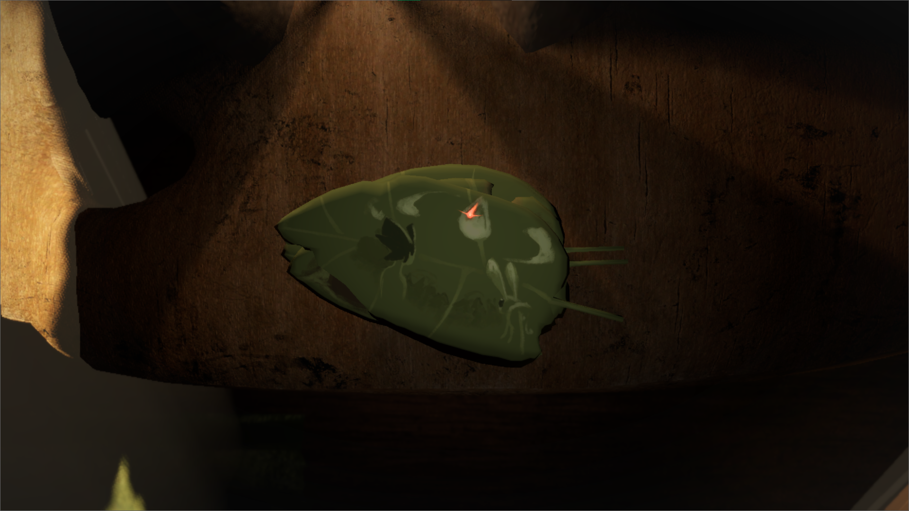
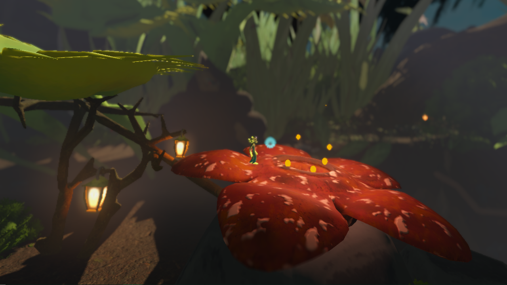

[Download on itch](https://s4g.itch.io/infested) -
[Project Page](https://mondanzo.de/#infested)

# About

A 2.5D Platformer Sidescroller set in a botanic world and a blooming protagonist fighting back against corrupted insects. Use various crystal themed abilities to march on against the hords of enemies, collect soul shards of your friends long gone and save your world.

## Key Informations

Engine: Godot 4.0 Release Candidate 1

Team Size: 7 people

Platform: PC

Genre: Jump and Run

Participation Duration: 10 weeks

Release: 10.03.2023

Number of Players: Single Player

# Role in the team

- **Lead role**
- Gameplay Programmer
- UI Programmer & Designer
- Tool Programming
- VCS Administrator
- Shader Programming

# Tasks in the project

- Player Character
  - [Player Movement](Scripts/Entities/Player.gd)
  - [Player Abilities](Scripts/Abilities/)
- [Platforming Obstacles](Scripts/Obstacles/)
- UI Menus

# Learnings taken

- First experience working in a team on a project.
- Communication is key
- Naming convention needs to stay consistent.

# Screenshots

